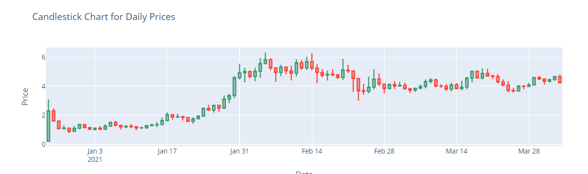

# Big Data Technology - Final Project

## Team Members
- Dhiman Kumar Sarker
- Mainuddin Talukdar
- Rayen Tajouri
- Nahom Asmelash

## Technologies & Environments
- Cloudera
- Apache Kafka
- Apache Spark Streaming
- Apache HBase
- Spark SQL
- Hadoop HDFS
- Jupyter

## System Overview
   

## Input Data: Stock
| Date | open | high | low | close | volumn |
| :--- | :--- | :--- | :--- | :--- | :--- |
2020-12-25 | 0.2 | 3.0885 | 0.2 | 2.2954 | 125977553.14 
2020-12-26 | 2.2958 | 2.4609 | 1.5717 | 1.5967 | 57039701.92 
2020-12-27 | 1.597 | 1.6516 | 1.036 | 1.0612 | 77797336.07 
2020-12-28 | 1.06 | 1.2787 | 1.0353 | 1.114 | 39346066.97 
2020-12-29 | 1.114 | 1.1166 | 0.7541 | 0.8845 | 53786032.77 
2020-12-30 | 0.8845 | 1.2574 | 0.8702 | 1.0934 | 57120473.11

## HBase Table Definition: Stocks

| RowKey | ColumnFamily: Price | ColumnFamily: Volumn |
| :---  | :---     | :---      |
| Date  | open - high - low - close | volumn |
| 2020-12-25 | 0.2 - 3.0885 - 0.2 - 2.2954 | 125977553.14 | 
| 2020-12-26 | 2.2958 - 2.4609 - 1.5717 - 1.5967 | 57039701.92 |
| 2020-12-27 | 1.597 - 1.6516 - 1.036 - 1.0612 | 77797336.07 | 
| 2020-12-28 | 1.06 - 1.2787 - 1.0353 - 1.114 | 39346066.97 | 
| 2020-12-29 | 1.114 - 1.1166 - 0.7541 - 0.8845 | 53786032.77 | 


## Build Scripts

### Create HBase Table
```bash
echo "disable 'stocks'" | hbase shell
echo "drop 'stocks'" | hbase shell
echo "create 'stocks', 'price', 'volumn'" | hbase shell
``` 

### Run Kafka Broker
```bash
cd /home/cloudera/Downloads/kafka_2.13-3.6.1
```
```bash
./bin/kafka-server-start.sh config/server.properties
``` 

### Run Kafka Producer 
```bash
java -jar kafka-producer-jar-with-dependencies.jar
``` 

### Run Spark Consumer
```bash
spark-submit --class "cs523.spark.streaming.SparkKafkaConsumer" --master local[*]  '/home/cloudera/workspace/spark-kafka-streaming/target/spark-consumer-jar-with-dependencies.jar'
``` 

### Run Spark SQL
```bash
spark-submit --class "cs523.spark.sqlclient.SparkSQLClient" --master local[*]  '/home/cloudera/project/spark-sql-client/target/spark-sql-client-jar-with-dependencies.jar'
```

## Output 

### Kafka Producer
    

### Spark Streaming
    

### HBase Table Data
    


## Visualization

   

   

   

   

   

   

   